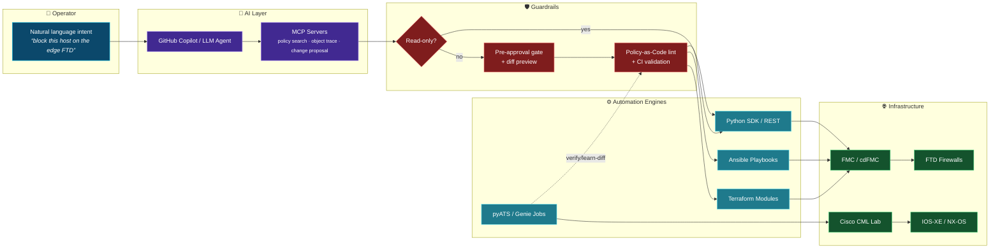
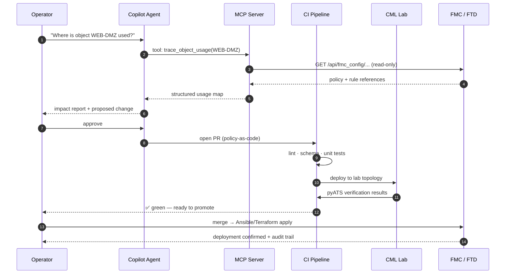
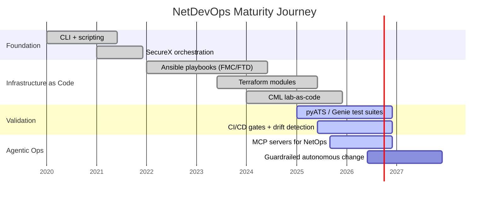

<!-- ══════════════════════════ HEADER ══════════════════════════ -->
<p align="center">
  
</p>

<p align="center">
  <a href="https://github.com/ranilf2005">
    
  </a>
</p>

<p align="center">
  
  <a href="https://github.com/ranilf2005?tab=followers"></a>
  <a href="https://github.com/ranilf2005?tab=repositories"></a>
  
</p>

---

## `~$ whoami`

```yaml
name:        Ranil Fernando
role:        Network Security Automation Engineer
domain:      Cisco Secure Firewall (FTD/FMC/cdFMC) · NetDevOps · AI Agents
location:    /dev/network
currently:
  - building:  MCP servers that let AI agents safely drive network + security infra
  - automating: FMC policy, object lifecycle & drift detection with Python + Ansible
  - breaking:   labs in Cisco Modeling Labs (CML) so production never breaks
philosophy:  "If you did it twice by hand, you already owed yourself a pipeline."
open_to:     collaboration on NetDevOps · Security Automation · Agentic Ops
```

<table>
<tr>
<td width="50%" valign="top">

### What I actually do
- **Automate Cisco Secure Firewall** — FMC-managed FTD policy, objects, NAT and access control via REST API, Ansible and Terraform.
- **Guardrailed AI Ops** — MCP servers that expose *read-first, approve-then-write* tools so Copilot can trace object usage and propose changes without touching prod blindly.
- **Network validation at scale** — pyATS / Genie parsers, learn-diff snapshots, and pre/post-change verification jobs.
- **CI/CD for network config** — GitHub Actions & GitLab pipelines that lint, test in CML, then promote.

</td>
<td width="50%" valign="top">

### Currently exploring
- Agentic workflows with **Model Context Protocol (MCP)**
- **Cisco Security Cloud Control (SCC) / cdFMC** automation
- Policy-as-code + drift detection for firewalls
- Observability & inventory visibility for Firepower estates
- Reproducible lab-as-code on **dCloud** and **CML**

</td>
</tr>
</table>

---

## `~$ cat tech-stack.json`

<div align="center">

**Languages & Scripting**


**Network & Security**


**Automation & IaC**


**AI / Agentic Tooling**


**Platform & Tooling**


</div>

---

## `~$ tree automation-architecture/`

> How my projects fit together — from natural language, through guardrails, into the network.



<details>
<summary><b>🔁 Change lifecycle — sequence view</b></summary>



</details>

<details>
<summary><b>🗺️ Automation maturity roadmap</b></summary>



</details>

---

## `~$ ls -la featured-projects/`

<div align="center">

| Project | What it does | Stack |
|---|---|---|
| **[🔥 fw-automation](https://github.com/ranilf2005/fw-automation)** | Automate Cisco Secure Firewall (FMC-managed FTD) with Python, Ansible & Terraform — plus **3 MCP servers** so an AI agent can search policy, trace object usage and propose changes behind a pre-approval gate. |     |
| **[🤖 cisco-pyats-mcp-network-automation](https://github.com/ranilf2005/cisco-pyats-mcp-network-automation)** | MCP server that lets GitHub Copilot run **guarded pyATS operations** against CML devices straight from natural language. |    |
| **[🛡️ csap](https://github.com/ranilf2005/csap)** | **Cisco Security Automation Platform** — a unified platform for orchestrating security automation workflows. |   |
| **[🧪 dcloud_secure_firewall_lab](https://github.com/ranilf2005/dcloud_secure_firewall_lab)** | Repeatable dCloud Secure Firewall lab build (FMC 7.7.0 / 10.0) — spin the whole environment up as code. |  |
| **[🏗️ dcloud_automation](https://github.com/ranilf2005/dcloud_automation)** | End-to-end lab pipeline: CML → FTD → FMC → GitLab CI/CD → Ansible → Terraform codebase server build. |   |
| **[⚡ -secureX-ext-port-scan-blocklist-wf](https://github.com/ranilf2005/-secureX-ext-port-scan-blocklist-wf)** | SecureX orchestration workflow chaining Stealthwatch Cloud, Umbrella, CTR, ThreatGRID & Webex for automated port-scan blocklisting. |  |
| **[📊 firepower-automation-inventory-visibility](https://github.com/ranilf2005/firepower-automation-inventory-visibility)** | Inventory & visibility automation for Cisco Secure Firewall estates. |  |
| **[🎓 clmel / clmel26 / pyatscml](https://github.com/ranilf2005?tab=repositories)** | Cisco Live Melbourne hands-on content — pyATS, Ansible, CML, Docker, Python, Ubuntu and GitLab CI/CD end-to-end. |   |

</div>

---

## `~$ git log --stat`

<div align="center">


</div>

### 🏆 Trophy Cabinet

<div align="center">
  
</div>

### 🐍 Contribution Snake

<div align="center">
  <picture>
    <source media="(prefers-color-scheme: dark)" srcset="https://raw.githubusercontent.com/ranilf2005/ranilf2005/output/github-contribution-grid-snake-dark.svg" />
    <source media="(prefers-color-scheme: light)" srcset="https://raw.githubusercontent.com/ranilf2005/ranilf2005/output/github-contribution-grid-snake.svg" />
    
  </picture>
</div>

---

## `~$ cat skills-matrix.md`

<div align="center">

| Capability | Level | Evidence |
|---|---|---|
| Cisco Secure Firewall (FTD/FMC) automation | `████████████████████░` 95% | `fw-automation`, `firepower-automation-inventory-visibility` |
| Python for NetDevOps | `██████████████████░░░` 90% | `csap`, `ftd-packet-tracer`, `CiscopyATS` |
| pyATS / Genie test automation | `██████████████████░░░` 88% | `cisco-pyats-mcp-network-automation`, `pyatscml` |
| Ansible / Infrastructure as Code | `█████████████████░░░░` 85% | `simple_cdfmc_ansible`, `cisco-scc-cdfmc-ansible` |
| CI/CD (GitHub Actions · GitLab) | `████████████████░░░░░` 80% | `dcloud_automation`, `clmel26_automation` |
| Terraform | `███████████████░░░░░░` 75% | `fw-automation` |
| MCP / Agentic tooling | `█████████████████░░░░` 85% | 3× MCP servers shipped |

</div>

---

## `~$ curl -s /connect`

<div align="center">

<a href="https://github.com/ranilf2005"></a>
<a href="https://ranilf2005.github.io/ranilfernando.github.io/"></a>
<a href="https://community.cisco.com/"></a>

</div>

---

<div align="center">

> ### `"Automate the boring. Guardrail the risky. Verify everything."`


</div>
